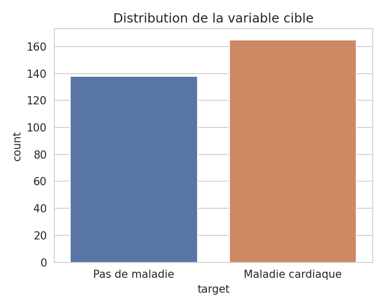
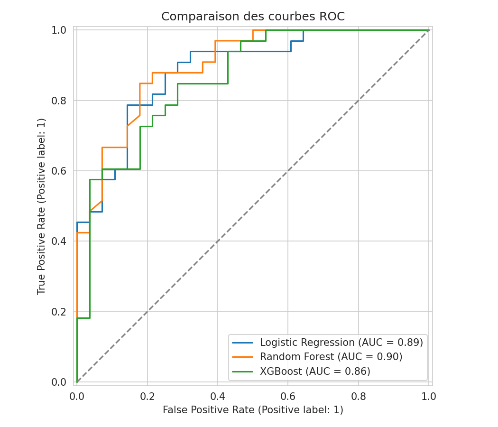
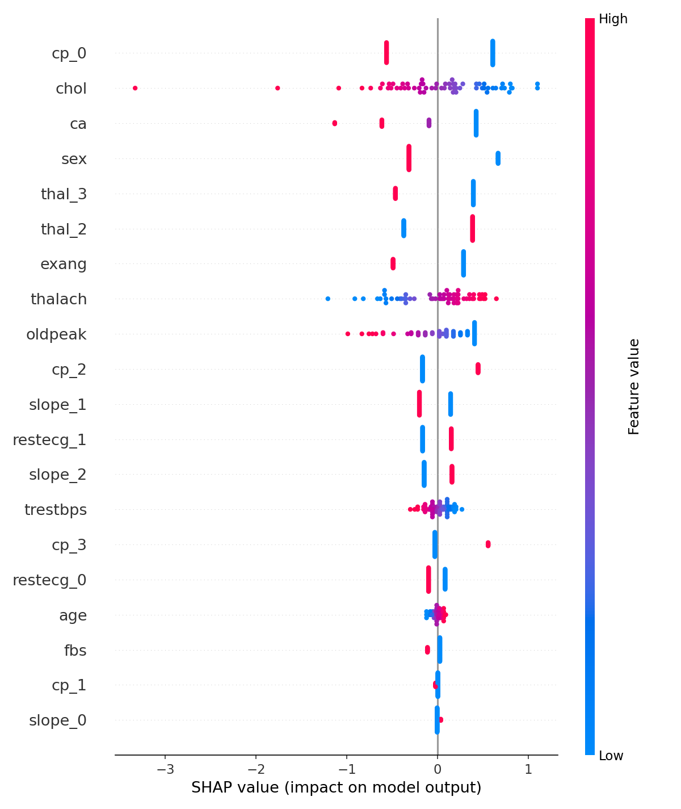
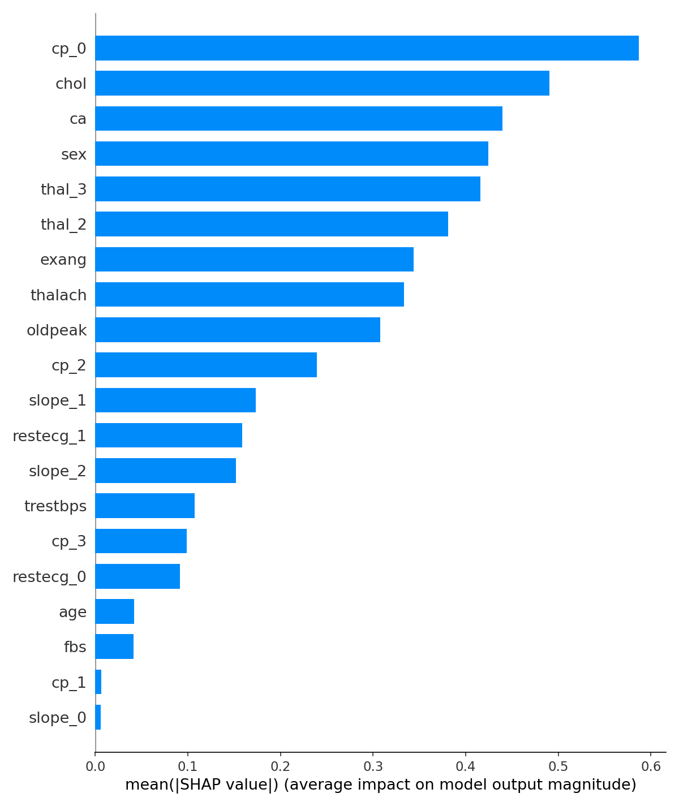
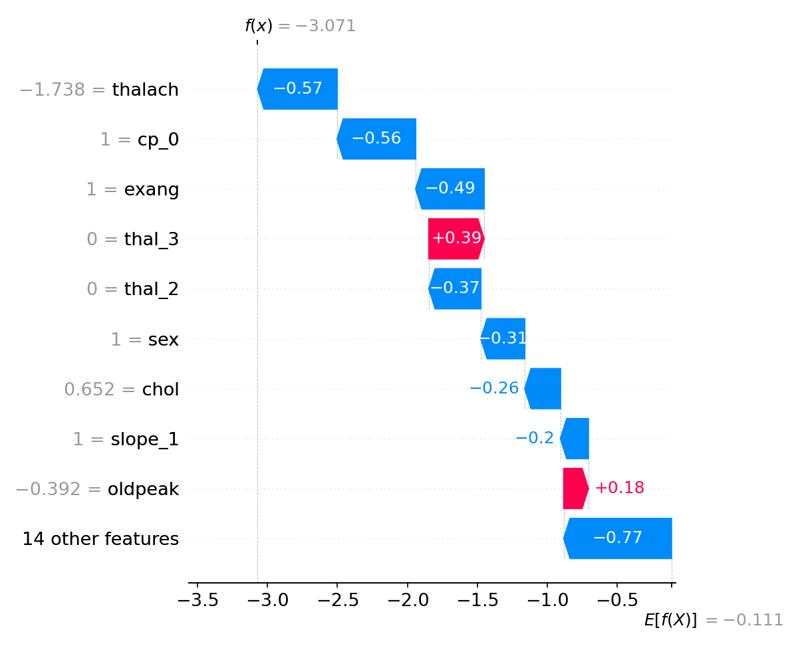

# 🫀 Heart Disease Prediction + Explainable AI (SHAP)


Prédiction du risque de maladie cardiaque à partir de données cliniques, avec **explicabilité complète des prédictions via SHAP**.

> ⚠️ **Avertissement** : ce projet est un exercice académique de machine learning / explicabilité. Il ne constitue en aucun cas un outil de diagnostic médical et ne doit pas être utilisé pour une décision clinique réelle.

## 📊 Aperçu



Le dataset **UCI Heart Disease** (Cleveland, 303 patients, 13 features cliniques) est utilisé pour entraîner et comparer plusieurs modèles de classification, puis expliquer leurs prédictions avec **SHAP (SHapley Additive exPlanations)**.

## 🎯 Objectif

1. Prédire la présence d'une maladie cardiaque à partir de caractéristiques cliniques (âge, tension, cholestérol, type de douleur thoracique, etc.)
2. Comparer plusieurs modèles de ML sur des métriques standards
3. **Expliquer** chaque prédiction — pas juste "malade / pas malade", mais *pourquoi* le modèle arrive à cette conclusion
4. Fournir une mini-app interactive pour tester le modèle sur un patient donné

## 🧰 Stack

- **Python**, Pandas, NumPy
- **Scikit-learn** (Logistic Regression, Random Forest)
- **XGBoost**
- **SHAP** pour l'explicabilité
- **Matplotlib / Seaborn** pour les visualisations
- **Streamlit** pour la démo interactive

## 📁 Structure du projet

```
heart-disease-shap/
│
├── data/
│   └── heart.csv                  # Dataset UCI Heart Disease (303 patients, 14 colonnes)
│
├── notebooks/
│   └── heart_disease_analysis.ipynb  # EDA, preprocessing, modélisation, SHAP
│
├── src/
│   ├── preprocessing.py           # Chargement + encodage + split/scaling
│   ├── train.py                   # Entraînement et comparaison des modèles
│   └── explain.py                 # Génération des graphiques SHAP
│
├── api/
│   ├── main.py                    # API FastAPI (/predict, /explain, /health)
│   └── schemas.py                 # Modèles Pydantic (validation des requêtes)
│
├── tests/
│   ├── test_preprocessing.py      # Tests unitaires du pipeline de données
│   └── test_api.py                # Tests unitaires de l'API
│
├── .github/workflows/
│   └── ci.yml                     # GitHub Actions : tests lancés à chaque push
│
├── models/
│   ├── best_model.joblib          # Meilleur modèle + scaler sauvegardés
│   └── results.json               # Métriques de tous les modèles
│
├── reports/                       # Graphiques pour ce README
├── web/
│   └── index.html                 # Dashboard front-end autonome (design personnalisé)
├── app.py                         # Application Streamlit (alternative tout-en-un)
├── requirements.txt
├── README.md
└── .gitignore
```

## 🏗️ Architecture

Le projet propose **trois façons** d'utiliser le modèle, qui illustrent trois approches différentes :

| Interface | Ce qu'elle montre | Lancer |
|---|---|---|
| `web/index.html` | Frontend autonome (HTML/CSS/JS), calcul exact des coefficients du modèle en JS | Ouvrir le fichier directement dans un navigateur |
| `app.py` (Streamlit) | Prototype rapide tout-en-un, Python de bout en bout | `streamlit run app.py` |
| `api/main.py` (FastAPI) | Vraie séparation front/back — un **backend** qui sert le modèle scikit-learn via une API REST, appelable par n'importe quel client | `uvicorn api.main:app --reload` |

### Utiliser l'API

```bash
uvicorn api.main:app --reload
# Documentation interactive : http://127.0.0.1:8000/docs
```

```bash
curl -X POST http://127.0.0.1:8000/predict \
  -H "Content-Type: application/json" \
  -d '{"age":63,"sex":1,"cp":3,"trestbps":145,"chol":233,"fbs":1,"restecg":0,"thalach":150,"exang":0,"oldpeak":2.3,"slope":0,"ca":0,"thal":1}'
```

Réponse :
```json
{
  "prediction": 1,
  "prediction_label": "Heart disease detected",
  "probability_disease": 0.6682,
  "probability_no_disease": 0.3318,
  "model_name": "Logistic Regression"
}
```

`/explain` renvoie en plus la décomposition SHAP complète (contribution de chaque variable).

### Tests

```bash
pytest tests/ -v
```

7 tests couvrant le pipeline de preprocessing et les endpoints de l'API. Lancés automatiquement par GitHub Actions à chaque push (voir le badge en haut de ce README une fois le repo poussé).

## 🔬 Dataset

**UCI Heart Disease (Cleveland)** — 303 patients, 13 variables + target binaire.

| Variable | Description |
|---|---|
| age | Âge |
| sex | Sexe (1 = homme, 0 = femme) |
| cp | Type de douleur thoracique (0-3) |
| trestbps | Tension artérielle au repos |
| chol | Cholestérol sérique (mg/dl) |
| fbs | Glycémie à jeun > 120 mg/dl |
| restecg | Résultats ECG au repos |
| thalach | Fréquence cardiaque maximale atteinte |
| exang | Angine induite par l'effort |
| oldpeak | Dépression du segment ST induite par l'effort |
| slope | Pente du segment ST à l'effort maximal |
| ca | Nombre de vaisseaux majeurs colorés par fluoroscopie |
| thal | Thalassémie |
| **target** | Présence de maladie cardiaque (0/1) |

Aucune valeur manquante, classes relativement équilibrées (165 positifs / 138 négatifs).

## 🤖 Résultats des modèles

| Modèle | Accuracy | Precision | Recall | F1-score | ROC-AUC |
|---|---|---|---|---|---|
| Logistic Regression | 0.803 | 0.784 | 0.879 | **0.829** | 0.885 |
| Random Forest | 0.787 | 0.763 | 0.879 | 0.817 | **0.899** |
| XGBoost | 0.770 | 0.757 | 0.848 | 0.800 | 0.862 |

*(Test set : 20%, split stratifié, random_state=42)*

**Modèle retenu : Logistic Regression** (meilleur F1-score), à la fois performant et simple à interpréter — un bon compromis pour un cas d'usage santé.



## 🧠 Explicabilité avec SHAP

### Importance globale des features



Le type de douleur thoracique (`cp`), le cholestérol, le nombre de vaisseaux colorés (`ca`) et le sexe sont parmi les facteurs qui influencent le plus les prédictions du modèle.

### Importance moyenne (bar plot)



### Explication d'une prédiction individuelle



Ce graphique décompose **une prédiction précise** : on voit exactement quelles variables ont poussé le score vers "maladie" (rouge) ou vers "pas de maladie" (bleu), et de combien.

## 💻 Mini-application Streamlit

L'app permet de saisir les caractéristiques d'un patient et d'obtenir instantanément :

```
Prediction: Heart disease detected

Probability:
Disease: 78%
No disease: 22%

Explication SHAP (waterfall plot) de cette prédiction précise
```

### Lancer l'app en local

```bash
git clone https://github.com/<ton-username>/heart-disease-shap.git
cd heart-disease-shap
pip install -r requirements.txt
streamlit run app.py
```

## 🚀 Reproduire le projet

```bash
# 1. Installer les dépendances
pip install -r requirements.txt

# 2. Entraîner les modèles
python src/train.py

# 3. Générer les graphiques SHAP
python src/explain.py

# 4. Lancer l'app
streamlit run app.py
```

## 📌 Pistes d'amélioration

- Cross-validation et tuning d'hyperparamètres (GridSearch / Optuna)
- Ajout d'un modèle plus avancé (LightGBM, réseau de neurones simple)
- Déploiement de l'app sur Streamlit Cloud avec un lien public
- Élargir le dataset (Hungarian, Switzerland, VA Long Beach) pour plus de robustesse

## 📄 Licence

Projet à but pédagogique. Dataset source : [UCI Machine Learning Repository — Heart Disease](https://archive.ics.uci.edu/dataset/45/heart-disease).
